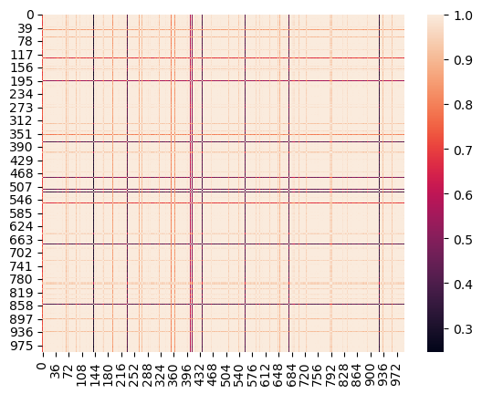
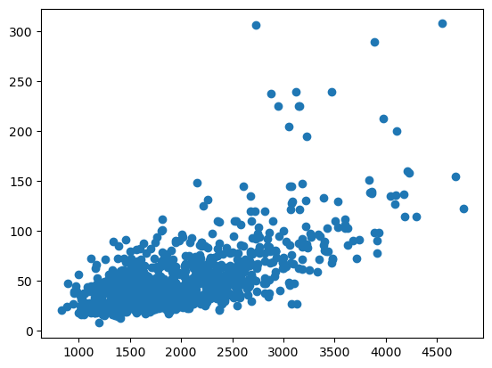

# Libraries I need


```python
import pandas as pd
import numpy as np
import matplotlib.pyplot as plt
import seaborn as sns
```

# Load DataSet


```python
df = pd.read_csv("houses.csv")
```

# EDA


```python
df.head()
```


<div>
<style scoped>
    .dataframe tbody tr th:only-of-type {
        vertical-align: middle;
    }

    .dataframe tbody tr th {
        vertical-align: top;
    }

    .dataframe thead th {
        text-align: right;
    }
</style>
<table border="1" class="dataframe">
  <thead>
    <tr style="text-align: right;">
      <th></th>
      <th>bedrooms</th>
      <th>bathrooms</th>
      <th>sqft_living</th>
      <th>sqft_lot</th>
      <th>floors</th>
      <th>waterfront</th>
      <th>view</th>
      <th>condition</th>
      <th>grade</th>
      <th>sqft_above</th>
      <th>sqft_basement</th>
      <th>yr_built</th>
      <th>yr_renovated</th>
      <th>zipcode</th>
      <th>lat</th>
      <th>long</th>
      <th>sqft_living15</th>
      <th>price</th>
    </tr>
  </thead>
  <tbody>
    <tr>
      <th>0</th>
      <td>3.0</td>
      <td>1.00</td>
      <td>1180.0</td>
      <td>5650.0</td>
      <td>1.0</td>
      <td>0.0</td>
      <td>0.0</td>
      <td>3.0</td>
      <td>7.0</td>
      <td>1180.0</td>
      <td>0.0</td>
      <td>1955.0</td>
      <td>0.0</td>
      <td>98178.0</td>
      <td>47.5112</td>
      <td>-122.257</td>
      <td>1340.0</td>
      <td>22.19</td>
    </tr>
    <tr>
      <th>1</th>
      <td>3.0</td>
      <td>2.25</td>
      <td>2570.0</td>
      <td>7242.0</td>
      <td>2.0</td>
      <td>0.0</td>
      <td>0.0</td>
      <td>3.0</td>
      <td>7.0</td>
      <td>2170.0</td>
      <td>400.0</td>
      <td>1951.0</td>
      <td>1991.0</td>
      <td>98125.0</td>
      <td>47.7210</td>
      <td>-122.319</td>
      <td>1690.0</td>
      <td>53.80</td>
    </tr>
    <tr>
      <th>2</th>
      <td>2.0</td>
      <td>1.00</td>
      <td>770.0</td>
      <td>10000.0</td>
      <td>1.0</td>
      <td>0.0</td>
      <td>0.0</td>
      <td>3.0</td>
      <td>6.0</td>
      <td>770.0</td>
      <td>0.0</td>
      <td>1933.0</td>
      <td>0.0</td>
      <td>98028.0</td>
      <td>47.7379</td>
      <td>-122.233</td>
      <td>2720.0</td>
      <td>18.00</td>
    </tr>
    <tr>
      <th>3</th>
      <td>4.0</td>
      <td>3.00</td>
      <td>1960.0</td>
      <td>5000.0</td>
      <td>1.0</td>
      <td>0.0</td>
      <td>0.0</td>
      <td>5.0</td>
      <td>7.0</td>
      <td>1050.0</td>
      <td>910.0</td>
      <td>1965.0</td>
      <td>0.0</td>
      <td>98136.0</td>
      <td>47.5208</td>
      <td>-122.393</td>
      <td>1360.0</td>
      <td>60.40</td>
    </tr>
    <tr>
      <th>4</th>
      <td>3.0</td>
      <td>2.00</td>
      <td>1680.0</td>
      <td>8080.0</td>
      <td>1.0</td>
      <td>0.0</td>
      <td>0.0</td>
      <td>3.0</td>
      <td>8.0</td>
      <td>1680.0</td>
      <td>0.0</td>
      <td>1987.0</td>
      <td>0.0</td>
      <td>98074.0</td>
      <td>47.6168</td>
      <td>-122.045</td>
      <td>1800.0</td>
      <td>51.00</td>
    </tr>
  </tbody>
</table>
</div>


```python
df.tail()
```


<div>
<style scoped>
    .dataframe tbody tr th:only-of-type {
        vertical-align: middle;
    }

    .dataframe tbody tr th {
        vertical-align: top;
    }

    .dataframe thead th {
        text-align: right;
    }
</style>
<table border="1" class="dataframe">
  <thead>
    <tr style="text-align: right;">
      <th></th>
      <th>bedrooms</th>
      <th>bathrooms</th>
      <th>sqft_living</th>
      <th>sqft_lot</th>
      <th>floors</th>
      <th>waterfront</th>
      <th>view</th>
      <th>condition</th>
      <th>grade</th>
      <th>sqft_above</th>
      <th>sqft_basement</th>
      <th>yr_built</th>
      <th>yr_renovated</th>
      <th>zipcode</th>
      <th>lat</th>
      <th>long</th>
      <th>sqft_living15</th>
      <th>price</th>
    </tr>
  </thead>
  <tbody>
    <tr>
      <th>995</th>
      <td>4.0</td>
      <td>2.50</td>
      <td>1860.0</td>
      <td>6325.0</td>
      <td>2.0</td>
      <td>0.0</td>
      <td>0.0</td>
      <td>4.0</td>
      <td>7.0</td>
      <td>1860.0</td>
      <td>0.0</td>
      <td>1991.0</td>
      <td>0.0</td>
      <td>98038.0</td>
      <td>47.3492</td>
      <td>-122.030</td>
      <td>1860.0</td>
      <td>29.100</td>
    </tr>
    <tr>
      <th>996</th>
      <td>2.0</td>
      <td>2.75</td>
      <td>1590.0</td>
      <td>20917.0</td>
      <td>1.5</td>
      <td>0.0</td>
      <td>0.0</td>
      <td>3.0</td>
      <td>5.0</td>
      <td>1590.0</td>
      <td>0.0</td>
      <td>1920.0</td>
      <td>0.0</td>
      <td>98001.0</td>
      <td>47.2786</td>
      <td>-122.250</td>
      <td>1310.0</td>
      <td>19.995</td>
    </tr>
    <tr>
      <th>997</th>
      <td>2.0</td>
      <td>1.00</td>
      <td>850.0</td>
      <td>2340.0</td>
      <td>1.0</td>
      <td>0.0</td>
      <td>0.0</td>
      <td>3.0</td>
      <td>7.0</td>
      <td>850.0</td>
      <td>0.0</td>
      <td>1922.0</td>
      <td>0.0</td>
      <td>98105.0</td>
      <td>47.6707</td>
      <td>-122.328</td>
      <td>1300.0</td>
      <td>55.350</td>
    </tr>
    <tr>
      <th>998</th>
      <td>2.0</td>
      <td>1.00</td>
      <td>1030.0</td>
      <td>4188.0</td>
      <td>1.0</td>
      <td>0.0</td>
      <td>0.0</td>
      <td>3.0</td>
      <td>8.0</td>
      <td>1030.0</td>
      <td>0.0</td>
      <td>1981.0</td>
      <td>0.0</td>
      <td>98038.0</td>
      <td>47.3738</td>
      <td>-122.057</td>
      <td>1450.0</td>
      <td>18.995</td>
    </tr>
    <tr>
      <th>999</th>
      <td>NaN</td>
      <td>NaN</td>
      <td>NaN</td>
      <td>NaN</td>
      <td>NaN</td>
      <td>NaN</td>
      <td>NaN</td>
      <td>NaN</td>
      <td>NaN</td>
      <td>NaN</td>
      <td>NaN</td>
      <td>NaN</td>
      <td>NaN</td>
      <td>NaN</td>
      <td>NaN</td>
      <td>NaN</td>
      <td>NaN</td>
      <td>NaN</td>
    </tr>
  </tbody>
</table>
</div>


```python
updated_df = df.drop(999)
```


```python
updated_df
```


<div>
<style scoped>
    .dataframe tbody tr th:only-of-type {
        vertical-align: middle;
    }

    .dataframe tbody tr th {
        vertical-align: top;
    }

    .dataframe thead th {
        text-align: right;
    }
</style>
<table border="1" class="dataframe">
  <thead>
    <tr style="text-align: right;">
      <th></th>
      <th>bedrooms</th>
      <th>bathrooms</th>
      <th>sqft_living</th>
      <th>sqft_lot</th>
      <th>floors</th>
      <th>waterfront</th>
      <th>view</th>
      <th>condition</th>
      <th>grade</th>
      <th>sqft_above</th>
      <th>sqft_basement</th>
      <th>yr_built</th>
      <th>yr_renovated</th>
      <th>zipcode</th>
      <th>lat</th>
      <th>long</th>
      <th>sqft_living15</th>
      <th>price</th>
    </tr>
  </thead>
  <tbody>
    <tr>
      <th>0</th>
      <td>3.0</td>
      <td>1.00</td>
      <td>1180.0</td>
      <td>5650.0</td>
      <td>1.0</td>
      <td>0.0</td>
      <td>0.0</td>
      <td>3.0</td>
      <td>7.0</td>
      <td>1180.0</td>
      <td>0.0</td>
      <td>1955.0</td>
      <td>0.0</td>
      <td>98178.0</td>
      <td>47.5112</td>
      <td>-122.257</td>
      <td>1340.0</td>
      <td>22.190</td>
    </tr>
    <tr>
      <th>1</th>
      <td>3.0</td>
      <td>2.25</td>
      <td>2570.0</td>
      <td>7242.0</td>
      <td>2.0</td>
      <td>0.0</td>
      <td>0.0</td>
      <td>3.0</td>
      <td>7.0</td>
      <td>2170.0</td>
      <td>400.0</td>
      <td>1951.0</td>
      <td>1991.0</td>
      <td>98125.0</td>
      <td>47.7210</td>
      <td>-122.319</td>
      <td>1690.0</td>
      <td>53.800</td>
    </tr>
    <tr>
      <th>2</th>
      <td>2.0</td>
      <td>1.00</td>
      <td>770.0</td>
      <td>10000.0</td>
      <td>1.0</td>
      <td>0.0</td>
      <td>0.0</td>
      <td>3.0</td>
      <td>6.0</td>
      <td>770.0</td>
      <td>0.0</td>
      <td>1933.0</td>
      <td>0.0</td>
      <td>98028.0</td>
      <td>47.7379</td>
      <td>-122.233</td>
      <td>2720.0</td>
      <td>18.000</td>
    </tr>
    <tr>
      <th>3</th>
      <td>4.0</td>
      <td>3.00</td>
      <td>1960.0</td>
      <td>5000.0</td>
      <td>1.0</td>
      <td>0.0</td>
      <td>0.0</td>
      <td>5.0</td>
      <td>7.0</td>
      <td>1050.0</td>
      <td>910.0</td>
      <td>1965.0</td>
      <td>0.0</td>
      <td>98136.0</td>
      <td>47.5208</td>
      <td>-122.393</td>
      <td>1360.0</td>
      <td>60.400</td>
    </tr>
    <tr>
      <th>4</th>
      <td>3.0</td>
      <td>2.00</td>
      <td>1680.0</td>
      <td>8080.0</td>
      <td>1.0</td>
      <td>0.0</td>
      <td>0.0</td>
      <td>3.0</td>
      <td>8.0</td>
      <td>1680.0</td>
      <td>0.0</td>
      <td>1987.0</td>
      <td>0.0</td>
      <td>98074.0</td>
      <td>47.6168</td>
      <td>-122.045</td>
      <td>1800.0</td>
      <td>51.000</td>
    </tr>
    <tr>
      <th>...</th>
      <td>...</td>
      <td>...</td>
      <td>...</td>
      <td>...</td>
      <td>...</td>
      <td>...</td>
      <td>...</td>
      <td>...</td>
      <td>...</td>
      <td>...</td>
      <td>...</td>
      <td>...</td>
      <td>...</td>
      <td>...</td>
      <td>...</td>
      <td>...</td>
      <td>...</td>
      <td>...</td>
    </tr>
    <tr>
      <th>994</th>
      <td>2.0</td>
      <td>1.00</td>
      <td>740.0</td>
      <td>6460.0</td>
      <td>1.0</td>
      <td>0.0</td>
      <td>0.0</td>
      <td>3.0</td>
      <td>6.0</td>
      <td>740.0</td>
      <td>0.0</td>
      <td>1953.0</td>
      <td>0.0</td>
      <td>98146.0</td>
      <td>47.5077</td>
      <td>-122.344</td>
      <td>1170.0</td>
      <td>17.850</td>
    </tr>
    <tr>
      <th>995</th>
      <td>4.0</td>
      <td>2.50</td>
      <td>1860.0</td>
      <td>6325.0</td>
      <td>2.0</td>
      <td>0.0</td>
      <td>0.0</td>
      <td>4.0</td>
      <td>7.0</td>
      <td>1860.0</td>
      <td>0.0</td>
      <td>1991.0</td>
      <td>0.0</td>
      <td>98038.0</td>
      <td>47.3492</td>
      <td>-122.030</td>
      <td>1860.0</td>
      <td>29.100</td>
    </tr>
    <tr>
      <th>996</th>
      <td>2.0</td>
      <td>2.75</td>
      <td>1590.0</td>
      <td>20917.0</td>
      <td>1.5</td>
      <td>0.0</td>
      <td>0.0</td>
      <td>3.0</td>
      <td>5.0</td>
      <td>1590.0</td>
      <td>0.0</td>
      <td>1920.0</td>
      <td>0.0</td>
      <td>98001.0</td>
      <td>47.2786</td>
      <td>-122.250</td>
      <td>1310.0</td>
      <td>19.995</td>
    </tr>
    <tr>
      <th>997</th>
      <td>2.0</td>
      <td>1.00</td>
      <td>850.0</td>
      <td>2340.0</td>
      <td>1.0</td>
      <td>0.0</td>
      <td>0.0</td>
      <td>3.0</td>
      <td>7.0</td>
      <td>850.0</td>
      <td>0.0</td>
      <td>1922.0</td>
      <td>0.0</td>
      <td>98105.0</td>
      <td>47.6707</td>
      <td>-122.328</td>
      <td>1300.0</td>
      <td>55.350</td>
    </tr>
    <tr>
      <th>998</th>
      <td>2.0</td>
      <td>1.00</td>
      <td>1030.0</td>
      <td>4188.0</td>
      <td>1.0</td>
      <td>0.0</td>
      <td>0.0</td>
      <td>3.0</td>
      <td>8.0</td>
      <td>1030.0</td>
      <td>0.0</td>
      <td>1981.0</td>
      <td>0.0</td>
      <td>98038.0</td>
      <td>47.3738</td>
      <td>-122.057</td>
      <td>1450.0</td>
      <td>18.995</td>
    </tr>
  </tbody>
</table>
<p>999 rows × 18 columns</p>
</div>


```python
np.corrcoef(updated_df['lat'] , updated_df['price'])
```


    array([[1.       , 0.3651415],
           [0.3651415, 1.       ]])


```python
updated_df = updated_df.drop(updated_df['view'])
```


```python
updated_df
```


<div>
<style scoped>
    .dataframe tbody tr th:only-of-type {
        vertical-align: middle;
    }

    .dataframe tbody tr th {
        vertical-align: top;
    }

    .dataframe thead th {
        text-align: right;
    }
</style>
<table border="1" class="dataframe">
  <thead>
    <tr style="text-align: right;">
      <th></th>
      <th>bedrooms</th>
      <th>bathrooms</th>
      <th>sqft_living</th>
      <th>sqft_lot</th>
      <th>floors</th>
      <th>waterfront</th>
      <th>view</th>
      <th>condition</th>
      <th>grade</th>
      <th>sqft_above</th>
      <th>sqft_basement</th>
      <th>yr_built</th>
      <th>yr_renovated</th>
      <th>zipcode</th>
      <th>lat</th>
      <th>long</th>
      <th>sqft_living15</th>
      <th>price</th>
    </tr>
  </thead>
  <tbody>
    <tr>
      <th>5</th>
      <td>4.0</td>
      <td>4.50</td>
      <td>5420.0</td>
      <td>101930.0</td>
      <td>1.0</td>
      <td>0.0</td>
      <td>0.0</td>
      <td>3.0</td>
      <td>11.0</td>
      <td>3890.0</td>
      <td>1530.0</td>
      <td>2001.0</td>
      <td>0.0</td>
      <td>98053.0</td>
      <td>47.6561</td>
      <td>-122.005</td>
      <td>4760.0</td>
      <td>123.000</td>
    </tr>
    <tr>
      <th>6</th>
      <td>3.0</td>
      <td>2.25</td>
      <td>1715.0</td>
      <td>6819.0</td>
      <td>2.0</td>
      <td>0.0</td>
      <td>0.0</td>
      <td>3.0</td>
      <td>7.0</td>
      <td>1715.0</td>
      <td>0.0</td>
      <td>1995.0</td>
      <td>0.0</td>
      <td>98003.0</td>
      <td>47.3097</td>
      <td>-122.327</td>
      <td>2238.0</td>
      <td>25.750</td>
    </tr>
    <tr>
      <th>7</th>
      <td>3.0</td>
      <td>1.50</td>
      <td>1060.0</td>
      <td>9711.0</td>
      <td>1.0</td>
      <td>0.0</td>
      <td>0.0</td>
      <td>3.0</td>
      <td>7.0</td>
      <td>1060.0</td>
      <td>0.0</td>
      <td>1963.0</td>
      <td>0.0</td>
      <td>98198.0</td>
      <td>47.4095</td>
      <td>-122.315</td>
      <td>1650.0</td>
      <td>29.185</td>
    </tr>
    <tr>
      <th>8</th>
      <td>3.0</td>
      <td>1.00</td>
      <td>1780.0</td>
      <td>7470.0</td>
      <td>1.0</td>
      <td>0.0</td>
      <td>0.0</td>
      <td>3.0</td>
      <td>7.0</td>
      <td>1050.0</td>
      <td>730.0</td>
      <td>1960.0</td>
      <td>0.0</td>
      <td>98146.0</td>
      <td>47.5123</td>
      <td>-122.337</td>
      <td>1780.0</td>
      <td>22.950</td>
    </tr>
    <tr>
      <th>9</th>
      <td>3.0</td>
      <td>2.50</td>
      <td>1890.0</td>
      <td>6560.0</td>
      <td>2.0</td>
      <td>0.0</td>
      <td>0.0</td>
      <td>3.0</td>
      <td>7.0</td>
      <td>1890.0</td>
      <td>0.0</td>
      <td>2003.0</td>
      <td>0.0</td>
      <td>98038.0</td>
      <td>47.3684</td>
      <td>-122.031</td>
      <td>2390.0</td>
      <td>32.300</td>
    </tr>
    <tr>
      <th>...</th>
      <td>...</td>
      <td>...</td>
      <td>...</td>
      <td>...</td>
      <td>...</td>
      <td>...</td>
      <td>...</td>
      <td>...</td>
      <td>...</td>
      <td>...</td>
      <td>...</td>
      <td>...</td>
      <td>...</td>
      <td>...</td>
      <td>...</td>
      <td>...</td>
      <td>...</td>
      <td>...</td>
    </tr>
    <tr>
      <th>994</th>
      <td>2.0</td>
      <td>1.00</td>
      <td>740.0</td>
      <td>6460.0</td>
      <td>1.0</td>
      <td>0.0</td>
      <td>0.0</td>
      <td>3.0</td>
      <td>6.0</td>
      <td>740.0</td>
      <td>0.0</td>
      <td>1953.0</td>
      <td>0.0</td>
      <td>98146.0</td>
      <td>47.5077</td>
      <td>-122.344</td>
      <td>1170.0</td>
      <td>17.850</td>
    </tr>
    <tr>
      <th>995</th>
      <td>4.0</td>
      <td>2.50</td>
      <td>1860.0</td>
      <td>6325.0</td>
      <td>2.0</td>
      <td>0.0</td>
      <td>0.0</td>
      <td>4.0</td>
      <td>7.0</td>
      <td>1860.0</td>
      <td>0.0</td>
      <td>1991.0</td>
      <td>0.0</td>
      <td>98038.0</td>
      <td>47.3492</td>
      <td>-122.030</td>
      <td>1860.0</td>
      <td>29.100</td>
    </tr>
    <tr>
      <th>996</th>
      <td>2.0</td>
      <td>2.75</td>
      <td>1590.0</td>
      <td>20917.0</td>
      <td>1.5</td>
      <td>0.0</td>
      <td>0.0</td>
      <td>3.0</td>
      <td>5.0</td>
      <td>1590.0</td>
      <td>0.0</td>
      <td>1920.0</td>
      <td>0.0</td>
      <td>98001.0</td>
      <td>47.2786</td>
      <td>-122.250</td>
      <td>1310.0</td>
      <td>19.995</td>
    </tr>
    <tr>
      <th>997</th>
      <td>2.0</td>
      <td>1.00</td>
      <td>850.0</td>
      <td>2340.0</td>
      <td>1.0</td>
      <td>0.0</td>
      <td>0.0</td>
      <td>3.0</td>
      <td>7.0</td>
      <td>850.0</td>
      <td>0.0</td>
      <td>1922.0</td>
      <td>0.0</td>
      <td>98105.0</td>
      <td>47.6707</td>
      <td>-122.328</td>
      <td>1300.0</td>
      <td>55.350</td>
    </tr>
    <tr>
      <th>998</th>
      <td>2.0</td>
      <td>1.00</td>
      <td>1030.0</td>
      <td>4188.0</td>
      <td>1.0</td>
      <td>0.0</td>
      <td>0.0</td>
      <td>3.0</td>
      <td>8.0</td>
      <td>1030.0</td>
      <td>0.0</td>
      <td>1981.0</td>
      <td>0.0</td>
      <td>98038.0</td>
      <td>47.3738</td>
      <td>-122.057</td>
      <td>1450.0</td>
      <td>18.995</td>
    </tr>
  </tbody>
</table>
<p>994 rows × 18 columns</p>
</div>


```python

```


```python

```


```python
features = updated_df.iloc[: , :-1]
```


```python
features
```


<div>
<style scoped>
    .dataframe tbody tr th:only-of-type {
        vertical-align: middle;
    }

    .dataframe tbody tr th {
        vertical-align: top;
    }

    .dataframe thead th {
        text-align: right;
    }
</style>
<table border="1" class="dataframe">
  <thead>
    <tr style="text-align: right;">
      <th></th>
      <th>bedrooms</th>
      <th>bathrooms</th>
      <th>sqft_living</th>
      <th>sqft_lot</th>
      <th>floors</th>
      <th>waterfront</th>
      <th>view</th>
      <th>condition</th>
      <th>grade</th>
      <th>sqft_above</th>
      <th>sqft_basement</th>
      <th>yr_built</th>
      <th>yr_renovated</th>
      <th>zipcode</th>
      <th>lat</th>
      <th>long</th>
      <th>sqft_living15</th>
    </tr>
  </thead>
  <tbody>
    <tr>
      <th>5</th>
      <td>4.0</td>
      <td>4.50</td>
      <td>5420.0</td>
      <td>101930.0</td>
      <td>1.0</td>
      <td>0.0</td>
      <td>0.0</td>
      <td>3.0</td>
      <td>11.0</td>
      <td>3890.0</td>
      <td>1530.0</td>
      <td>2001.0</td>
      <td>0.0</td>
      <td>98053.0</td>
      <td>47.6561</td>
      <td>-122.005</td>
      <td>4760.0</td>
    </tr>
    <tr>
      <th>6</th>
      <td>3.0</td>
      <td>2.25</td>
      <td>1715.0</td>
      <td>6819.0</td>
      <td>2.0</td>
      <td>0.0</td>
      <td>0.0</td>
      <td>3.0</td>
      <td>7.0</td>
      <td>1715.0</td>
      <td>0.0</td>
      <td>1995.0</td>
      <td>0.0</td>
      <td>98003.0</td>
      <td>47.3097</td>
      <td>-122.327</td>
      <td>2238.0</td>
    </tr>
    <tr>
      <th>7</th>
      <td>3.0</td>
      <td>1.50</td>
      <td>1060.0</td>
      <td>9711.0</td>
      <td>1.0</td>
      <td>0.0</td>
      <td>0.0</td>
      <td>3.0</td>
      <td>7.0</td>
      <td>1060.0</td>
      <td>0.0</td>
      <td>1963.0</td>
      <td>0.0</td>
      <td>98198.0</td>
      <td>47.4095</td>
      <td>-122.315</td>
      <td>1650.0</td>
    </tr>
    <tr>
      <th>8</th>
      <td>3.0</td>
      <td>1.00</td>
      <td>1780.0</td>
      <td>7470.0</td>
      <td>1.0</td>
      <td>0.0</td>
      <td>0.0</td>
      <td>3.0</td>
      <td>7.0</td>
      <td>1050.0</td>
      <td>730.0</td>
      <td>1960.0</td>
      <td>0.0</td>
      <td>98146.0</td>
      <td>47.5123</td>
      <td>-122.337</td>
      <td>1780.0</td>
    </tr>
    <tr>
      <th>9</th>
      <td>3.0</td>
      <td>2.50</td>
      <td>1890.0</td>
      <td>6560.0</td>
      <td>2.0</td>
      <td>0.0</td>
      <td>0.0</td>
      <td>3.0</td>
      <td>7.0</td>
      <td>1890.0</td>
      <td>0.0</td>
      <td>2003.0</td>
      <td>0.0</td>
      <td>98038.0</td>
      <td>47.3684</td>
      <td>-122.031</td>
      <td>2390.0</td>
    </tr>
    <tr>
      <th>...</th>
      <td>...</td>
      <td>...</td>
      <td>...</td>
      <td>...</td>
      <td>...</td>
      <td>...</td>
      <td>...</td>
      <td>...</td>
      <td>...</td>
      <td>...</td>
      <td>...</td>
      <td>...</td>
      <td>...</td>
      <td>...</td>
      <td>...</td>
      <td>...</td>
      <td>...</td>
    </tr>
    <tr>
      <th>994</th>
      <td>2.0</td>
      <td>1.00</td>
      <td>740.0</td>
      <td>6460.0</td>
      <td>1.0</td>
      <td>0.0</td>
      <td>0.0</td>
      <td>3.0</td>
      <td>6.0</td>
      <td>740.0</td>
      <td>0.0</td>
      <td>1953.0</td>
      <td>0.0</td>
      <td>98146.0</td>
      <td>47.5077</td>
      <td>-122.344</td>
      <td>1170.0</td>
    </tr>
    <tr>
      <th>995</th>
      <td>4.0</td>
      <td>2.50</td>
      <td>1860.0</td>
      <td>6325.0</td>
      <td>2.0</td>
      <td>0.0</td>
      <td>0.0</td>
      <td>4.0</td>
      <td>7.0</td>
      <td>1860.0</td>
      <td>0.0</td>
      <td>1991.0</td>
      <td>0.0</td>
      <td>98038.0</td>
      <td>47.3492</td>
      <td>-122.030</td>
      <td>1860.0</td>
    </tr>
    <tr>
      <th>996</th>
      <td>2.0</td>
      <td>2.75</td>
      <td>1590.0</td>
      <td>20917.0</td>
      <td>1.5</td>
      <td>0.0</td>
      <td>0.0</td>
      <td>3.0</td>
      <td>5.0</td>
      <td>1590.0</td>
      <td>0.0</td>
      <td>1920.0</td>
      <td>0.0</td>
      <td>98001.0</td>
      <td>47.2786</td>
      <td>-122.250</td>
      <td>1310.0</td>
    </tr>
    <tr>
      <th>997</th>
      <td>2.0</td>
      <td>1.00</td>
      <td>850.0</td>
      <td>2340.0</td>
      <td>1.0</td>
      <td>0.0</td>
      <td>0.0</td>
      <td>3.0</td>
      <td>7.0</td>
      <td>850.0</td>
      <td>0.0</td>
      <td>1922.0</td>
      <td>0.0</td>
      <td>98105.0</td>
      <td>47.6707</td>
      <td>-122.328</td>
      <td>1300.0</td>
    </tr>
    <tr>
      <th>998</th>
      <td>2.0</td>
      <td>1.00</td>
      <td>1030.0</td>
      <td>4188.0</td>
      <td>1.0</td>
      <td>0.0</td>
      <td>0.0</td>
      <td>3.0</td>
      <td>8.0</td>
      <td>1030.0</td>
      <td>0.0</td>
      <td>1981.0</td>
      <td>0.0</td>
      <td>98038.0</td>
      <td>47.3738</td>
      <td>-122.057</td>
      <td>1450.0</td>
    </tr>
  </tbody>
</table>
<p>994 rows × 17 columns</p>
</div>


```python
target = updated_df.iloc[: , -1]
```


```python
target
```


    5      123.000
    6       25.750
    7       29.185
    8       22.950
    9       32.300
            ...   
    994     17.850
    995     29.100
    996     19.995
    997     55.350
    998     18.995
    Name: price, Length: 994, dtype: float64


```python
correlations = np.corrcoef(updated_df)
```


```python
correlations
```


    array([[1.        , 0.71774715, 0.73832108, ..., 0.81004424, 0.68571523,
            0.69922917],
           [0.71774715, 1.        , 0.99947684, ..., 0.98957097, 0.99891172,
            0.99959953],
           [0.73832108, 0.99947684, 1.        , ..., 0.99351447, 0.99718712,
            0.99841424],
           ...,
           [0.81004424, 0.98957097, 0.99351447, ..., 1.        , 0.98222754,
            0.9855649 ],
           [0.68571523, 0.99891172, 0.99718712, ..., 0.98222754, 1.        ,
            0.99982271],
           [0.69922917, 0.99959953, 0.99841424, ..., 0.9855649 , 0.99982271,
            1.        ]])


```python
sns.heatmap(correlations)
plt.show()
```


    

    


```python
updated_df.isna().sum()
```


    bedrooms         0
    bathrooms        0
    sqft_living      0
    sqft_lot         0
    floors           0
    waterfront       0
    view             0
    condition        0
    grade            0
    sqft_above       0
    sqft_basement    0
    yr_built         0
    yr_renovated     0
    zipcode          0
    lat              0
    long             0
    sqft_living15    0
    price            0
    dtype: int64


```python
plt.scatter(updated_df['sqft_living15'] , updated_df['price'])
```


    <matplotlib.collections.PathCollection at 0x1f4d2836450>


    

    


Have a Linear Relation between "sqft_living15" and "Price"

# Split the Data


```python
from sklearn.model_selection import train_test_split
```


```python
x_train , x_test , y_train , y_test =train_test_split(features , target , test_size = 0.25  , shuffle =True)
```

# Train Our Model


```python
from sklearn.linear_model import LinearRegression
```


```python
Regressor_Model = LinearRegression()
```


```python
Regressor_Model.fit(x_train , y_train)
```


<style>#sk-container-id-19 {color: black;}#sk-container-id-19 pre{padding: 0;}#sk-container-id-19 div.sk-toggleable {background-color: white;}#sk-container-id-19 label.sk-toggleable__label {cursor: pointer;display: block;width: 100%;margin-bottom: 0;padding: 0.3em;box-sizing: border-box;text-align: center;}#sk-container-id-19 label.sk-toggleable__label-arrow:before {content: "▸";float: left;margin-right: 0.25em;color: #696969;}#sk-container-id-19 label.sk-toggleable__label-arrow:hover:before {color: black;}#sk-container-id-19 div.sk-estimator:hover label.sk-toggleable__label-arrow:before {color: black;}#sk-container-id-19 div.sk-toggleable__content {max-height: 0;max-width: 0;overflow: hidden;text-align: left;background-color: #f0f8ff;}#sk-container-id-19 div.sk-toggleable__content pre {margin: 0.2em;color: black;border-radius: 0.25em;background-color: #f0f8ff;}#sk-container-id-19 input.sk-toggleable__control:checked~div.sk-toggleable__content {max-height: 200px;max-width: 100%;overflow: auto;}#sk-container-id-19 input.sk-toggleable__control:checked~label.sk-toggleable__label-arrow:before {content: "▾";}#sk-container-id-19 div.sk-estimator input.sk-toggleable__control:checked~label.sk-toggleable__label {background-color: #d4ebff;}#sk-container-id-19 div.sk-label input.sk-toggleable__control:checked~label.sk-toggleable__label {background-color: #d4ebff;}#sk-container-id-19 input.sk-hidden--visually {border: 0;clip: rect(1px 1px 1px 1px);clip: rect(1px, 1px, 1px, 1px);height: 1px;margin: -1px;overflow: hidden;padding: 0;position: absolute;width: 1px;}#sk-container-id-19 div.sk-estimator {font-family: monospace;background-color: #f0f8ff;border: 1px dotted black;border-radius: 0.25em;box-sizing: border-box;margin-bottom: 0.5em;}#sk-container-id-19 div.sk-estimator:hover {background-color: #d4ebff;}#sk-container-id-19 div.sk-parallel-item::after {content: "";width: 100%;border-bottom: 1px solid gray;flex-grow: 1;}#sk-container-id-19 div.sk-label:hover label.sk-toggleable__label {background-color: #d4ebff;}#sk-container-id-19 div.sk-serial::before {content: "";position: absolute;border-left: 1px solid gray;box-sizing: border-box;top: 0;bottom: 0;left: 50%;z-index: 0;}#sk-container-id-19 div.sk-serial {display: flex;flex-direction: column;align-items: center;background-color: white;padding-right: 0.2em;padding-left: 0.2em;position: relative;}#sk-container-id-19 div.sk-item {position: relative;z-index: 1;}#sk-container-id-19 div.sk-parallel {display: flex;align-items: stretch;justify-content: center;background-color: white;position: relative;}#sk-container-id-19 div.sk-item::before, #sk-container-id-19 div.sk-parallel-item::before {content: "";position: absolute;border-left: 1px solid gray;box-sizing: border-box;top: 0;bottom: 0;left: 50%;z-index: -1;}#sk-container-id-19 div.sk-parallel-item {display: flex;flex-direction: column;z-index: 1;position: relative;background-color: white;}#sk-container-id-19 div.sk-parallel-item:first-child::after {align-self: flex-end;width: 50%;}#sk-container-id-19 div.sk-parallel-item:last-child::after {align-self: flex-start;width: 50%;}#sk-container-id-19 div.sk-parallel-item:only-child::after {width: 0;}#sk-container-id-19 div.sk-dashed-wrapped {border: 1px dashed gray;margin: 0 0.4em 0.5em 0.4em;box-sizing: border-box;padding-bottom: 0.4em;background-color: white;}#sk-container-id-19 div.sk-label label {font-family: monospace;font-weight: bold;display: inline-block;line-height: 1.2em;}#sk-container-id-19 div.sk-label-container {text-align: center;}#sk-container-id-19 div.sk-container {/* jupyter's `normalize.less` sets `[hidden] { display: none; }` but bootstrap.min.css set `[hidden] { display: none !important; }` so we also need the `!important` here to be able to override the default hidden behavior on the sphinx rendered scikit-learn.org. See: https://github.com/scikit-learn/scikit-learn/issues/21755 */display: inline-block !important;position: relative;}#sk-container-id-19 div.sk-text-repr-fallback {display: none;}</style><div id="sk-container-id-19" class="sk-top-container"><div class="sk-text-repr-fallback"><pre>LinearRegression()</pre><b>In a Jupyter environment, please rerun this cell to show the HTML representation or trust the notebook. <br />On GitHub, the HTML representation is unable to render, please try loading this page with nbviewer.org.</b></div><div class="sk-container" hidden><div class="sk-item"><div class="sk-estimator sk-toggleable"><input class="sk-toggleable__control sk-hidden--visually" id="sk-estimator-id-19" type="checkbox" checked><label for="sk-estimator-id-19" class="sk-toggleable__label sk-toggleable__label-arrow">LinearRegression</label><div class="sk-toggleable__content"><pre>LinearRegression()</pre></div></div></div></div></div>


```python
print("The Model Performance" , Regressor_Model.score(x_train , y_train)*100 , "%")
```

    The Model Performance 74.45850437163605 %
    

our Model is Very Week


```python
from sklearn.preprocessing import PolynomialFeatures
```


```python
polynomial_model = PolynomialFeatures(degree=2)
```


```python
feature_Poly = polynomial_model.fit_transform(features)
```


```python
from sklearn.preprocessing import MinMaxScaler
```


```python
minmax_scaler = MinMaxScaler()
```


```python
new_features = minmax_scaler.fit_transform(feature_Poly)
```


```python
new_features
```


    array([[0.        , 0.57142857, 0.9       , ..., 0.37824855, 0.        ,
            1.        ],
           [0.        , 0.42857143, 0.45      , ..., 0.79076503, 0.64063875,
            0.19663175],
           [0.        , 0.42857143, 0.3       , ..., 0.77537224, 0.79078968,
            0.09256806],
           ...,
           [0.        , 0.28571429, 0.55      , ..., 0.69202087, 0.87775693,
            0.04675743],
           [0.        , 0.28571429, 0.2       , ..., 0.79204784, 0.8800966 ,
            0.04556938],
           [0.        , 0.28571429, 0.2       , ..., 0.4447925 , 0.84262308,
            0.06434609]])


```python
features_train , features_test , target_train ,target_test = train_test_split(new_features , target   , shuffle=True)
```


```python
features_train.shape
```


    (745, 171)


```python
features_test.shape
```


    (249, 171)


```python
target_train.shape
```


    (745,)


```python
target_test.shape
```


    (249,)


```python
NewRegressorModel = LinearRegression()
```


```python
NewRegressorModel.fit(features_train , target_train )
```


<style>#sk-container-id-20 {color: black;}#sk-container-id-20 pre{padding: 0;}#sk-container-id-20 div.sk-toggleable {background-color: white;}#sk-container-id-20 label.sk-toggleable__label {cursor: pointer;display: block;width: 100%;margin-bottom: 0;padding: 0.3em;box-sizing: border-box;text-align: center;}#sk-container-id-20 label.sk-toggleable__label-arrow:before {content: "▸";float: left;margin-right: 0.25em;color: #696969;}#sk-container-id-20 label.sk-toggleable__label-arrow:hover:before {color: black;}#sk-container-id-20 div.sk-estimator:hover label.sk-toggleable__label-arrow:before {color: black;}#sk-container-id-20 div.sk-toggleable__content {max-height: 0;max-width: 0;overflow: hidden;text-align: left;background-color: #f0f8ff;}#sk-container-id-20 div.sk-toggleable__content pre {margin: 0.2em;color: black;border-radius: 0.25em;background-color: #f0f8ff;}#sk-container-id-20 input.sk-toggleable__control:checked~div.sk-toggleable__content {max-height: 200px;max-width: 100%;overflow: auto;}#sk-container-id-20 input.sk-toggleable__control:checked~label.sk-toggleable__label-arrow:before {content: "▾";}#sk-container-id-20 div.sk-estimator input.sk-toggleable__control:checked~label.sk-toggleable__label {background-color: #d4ebff;}#sk-container-id-20 div.sk-label input.sk-toggleable__control:checked~label.sk-toggleable__label {background-color: #d4ebff;}#sk-container-id-20 input.sk-hidden--visually {border: 0;clip: rect(1px 1px 1px 1px);clip: rect(1px, 1px, 1px, 1px);height: 1px;margin: -1px;overflow: hidden;padding: 0;position: absolute;width: 1px;}#sk-container-id-20 div.sk-estimator {font-family: monospace;background-color: #f0f8ff;border: 1px dotted black;border-radius: 0.25em;box-sizing: border-box;margin-bottom: 0.5em;}#sk-container-id-20 div.sk-estimator:hover {background-color: #d4ebff;}#sk-container-id-20 div.sk-parallel-item::after {content: "";width: 100%;border-bottom: 1px solid gray;flex-grow: 1;}#sk-container-id-20 div.sk-label:hover label.sk-toggleable__label {background-color: #d4ebff;}#sk-container-id-20 div.sk-serial::before {content: "";position: absolute;border-left: 1px solid gray;box-sizing: border-box;top: 0;bottom: 0;left: 50%;z-index: 0;}#sk-container-id-20 div.sk-serial {display: flex;flex-direction: column;align-items: center;background-color: white;padding-right: 0.2em;padding-left: 0.2em;position: relative;}#sk-container-id-20 div.sk-item {position: relative;z-index: 1;}#sk-container-id-20 div.sk-parallel {display: flex;align-items: stretch;justify-content: center;background-color: white;position: relative;}#sk-container-id-20 div.sk-item::before, #sk-container-id-20 div.sk-parallel-item::before {content: "";position: absolute;border-left: 1px solid gray;box-sizing: border-box;top: 0;bottom: 0;left: 50%;z-index: -1;}#sk-container-id-20 div.sk-parallel-item {display: flex;flex-direction: column;z-index: 1;position: relative;background-color: white;}#sk-container-id-20 div.sk-parallel-item:first-child::after {align-self: flex-end;width: 50%;}#sk-container-id-20 div.sk-parallel-item:last-child::after {align-self: flex-start;width: 50%;}#sk-container-id-20 div.sk-parallel-item:only-child::after {width: 0;}#sk-container-id-20 div.sk-dashed-wrapped {border: 1px dashed gray;margin: 0 0.4em 0.5em 0.4em;box-sizing: border-box;padding-bottom: 0.4em;background-color: white;}#sk-container-id-20 div.sk-label label {font-family: monospace;font-weight: bold;display: inline-block;line-height: 1.2em;}#sk-container-id-20 div.sk-label-container {text-align: center;}#sk-container-id-20 div.sk-container {/* jupyter's `normalize.less` sets `[hidden] { display: none; }` but bootstrap.min.css set `[hidden] { display: none !important; }` so we also need the `!important` here to be able to override the default hidden behavior on the sphinx rendered scikit-learn.org. See: https://github.com/scikit-learn/scikit-learn/issues/21755 */display: inline-block !important;position: relative;}#sk-container-id-20 div.sk-text-repr-fallback {display: none;}</style><div id="sk-container-id-20" class="sk-top-container"><div class="sk-text-repr-fallback"><pre>LinearRegression()</pre><b>In a Jupyter environment, please rerun this cell to show the HTML representation or trust the notebook. <br />On GitHub, the HTML representation is unable to render, please try loading this page with nbviewer.org.</b></div><div class="sk-container" hidden><div class="sk-item"><div class="sk-estimator sk-toggleable"><input class="sk-toggleable__control sk-hidden--visually" id="sk-estimator-id-20" type="checkbox" checked><label for="sk-estimator-id-20" class="sk-toggleable__label sk-toggleable__label-arrow">LinearRegression</label><div class="sk-toggleable__content"><pre>LinearRegression()</pre></div></div></div></div></div>


```python
print("The New Model Training Performance " ,NewRegressorModel.score(features_train ,target_train)*100 , "%" )
```

    The New Model Training Performance  91.32808509147567 %
    


```python
preds = NewRegressorModel.predict(features_test)
```


```python
print("The Accuracy  of Test ", NewRegressorModel.score(features_test , target_test)*100 ,"%")
```

    The Accuracy  of Test  -3.052230314469714e+17 %
    


```python
from sklearn.metrics import r2_score
```


```python
ModelEvaluation= r2_score(target_test , preds )
```


```python
ModelEvaluation*100
```


    -3.052230314469714e+17


# Using Ridge Model 


```python
 from sklearn.linear_model import Ridge
```


```python
RidgeRegressor= Ridge(alpha=1.0 , random_state=33)
```


```python
RidgeRegressor.fit(features_train , target_train)
```


<style>#sk-container-id-21 {color: black;}#sk-container-id-21 pre{padding: 0;}#sk-container-id-21 div.sk-toggleable {background-color: white;}#sk-container-id-21 label.sk-toggleable__label {cursor: pointer;display: block;width: 100%;margin-bottom: 0;padding: 0.3em;box-sizing: border-box;text-align: center;}#sk-container-id-21 label.sk-toggleable__label-arrow:before {content: "▸";float: left;margin-right: 0.25em;color: #696969;}#sk-container-id-21 label.sk-toggleable__label-arrow:hover:before {color: black;}#sk-container-id-21 div.sk-estimator:hover label.sk-toggleable__label-arrow:before {color: black;}#sk-container-id-21 div.sk-toggleable__content {max-height: 0;max-width: 0;overflow: hidden;text-align: left;background-color: #f0f8ff;}#sk-container-id-21 div.sk-toggleable__content pre {margin: 0.2em;color: black;border-radius: 0.25em;background-color: #f0f8ff;}#sk-container-id-21 input.sk-toggleable__control:checked~div.sk-toggleable__content {max-height: 200px;max-width: 100%;overflow: auto;}#sk-container-id-21 input.sk-toggleable__control:checked~label.sk-toggleable__label-arrow:before {content: "▾";}#sk-container-id-21 div.sk-estimator input.sk-toggleable__control:checked~label.sk-toggleable__label {background-color: #d4ebff;}#sk-container-id-21 div.sk-label input.sk-toggleable__control:checked~label.sk-toggleable__label {background-color: #d4ebff;}#sk-container-id-21 input.sk-hidden--visually {border: 0;clip: rect(1px 1px 1px 1px);clip: rect(1px, 1px, 1px, 1px);height: 1px;margin: -1px;overflow: hidden;padding: 0;position: absolute;width: 1px;}#sk-container-id-21 div.sk-estimator {font-family: monospace;background-color: #f0f8ff;border: 1px dotted black;border-radius: 0.25em;box-sizing: border-box;margin-bottom: 0.5em;}#sk-container-id-21 div.sk-estimator:hover {background-color: #d4ebff;}#sk-container-id-21 div.sk-parallel-item::after {content: "";width: 100%;border-bottom: 1px solid gray;flex-grow: 1;}#sk-container-id-21 div.sk-label:hover label.sk-toggleable__label {background-color: #d4ebff;}#sk-container-id-21 div.sk-serial::before {content: "";position: absolute;border-left: 1px solid gray;box-sizing: border-box;top: 0;bottom: 0;left: 50%;z-index: 0;}#sk-container-id-21 div.sk-serial {display: flex;flex-direction: column;align-items: center;background-color: white;padding-right: 0.2em;padding-left: 0.2em;position: relative;}#sk-container-id-21 div.sk-item {position: relative;z-index: 1;}#sk-container-id-21 div.sk-parallel {display: flex;align-items: stretch;justify-content: center;background-color: white;position: relative;}#sk-container-id-21 div.sk-item::before, #sk-container-id-21 div.sk-parallel-item::before {content: "";position: absolute;border-left: 1px solid gray;box-sizing: border-box;top: 0;bottom: 0;left: 50%;z-index: -1;}#sk-container-id-21 div.sk-parallel-item {display: flex;flex-direction: column;z-index: 1;position: relative;background-color: white;}#sk-container-id-21 div.sk-parallel-item:first-child::after {align-self: flex-end;width: 50%;}#sk-container-id-21 div.sk-parallel-item:last-child::after {align-self: flex-start;width: 50%;}#sk-container-id-21 div.sk-parallel-item:only-child::after {width: 0;}#sk-container-id-21 div.sk-dashed-wrapped {border: 1px dashed gray;margin: 0 0.4em 0.5em 0.4em;box-sizing: border-box;padding-bottom: 0.4em;background-color: white;}#sk-container-id-21 div.sk-label label {font-family: monospace;font-weight: bold;display: inline-block;line-height: 1.2em;}#sk-container-id-21 div.sk-label-container {text-align: center;}#sk-container-id-21 div.sk-container {/* jupyter's `normalize.less` sets `[hidden] { display: none; }` but bootstrap.min.css set `[hidden] { display: none !important; }` so we also need the `!important` here to be able to override the default hidden behavior on the sphinx rendered scikit-learn.org. See: https://github.com/scikit-learn/scikit-learn/issues/21755 */display: inline-block !important;position: relative;}#sk-container-id-21 div.sk-text-repr-fallback {display: none;}</style><div id="sk-container-id-21" class="sk-top-container"><div class="sk-text-repr-fallback"><pre>Ridge(random_state=33)</pre><b>In a Jupyter environment, please rerun this cell to show the HTML representation or trust the notebook. <br />On GitHub, the HTML representation is unable to render, please try loading this page with nbviewer.org.</b></div><div class="sk-container" hidden><div class="sk-item"><div class="sk-estimator sk-toggleable"><input class="sk-toggleable__control sk-hidden--visually" id="sk-estimator-id-21" type="checkbox" checked><label for="sk-estimator-id-21" class="sk-toggleable__label sk-toggleable__label-arrow">Ridge</label><div class="sk-toggleable__content"><pre>Ridge(random_state=33)</pre></div></div></div></div></div>


```python
print("The Training Score " , RidgeRegressor.score(features_train ,target_train )*100 , "%")
```

    The Training Score  83.47653960120242 %
    


```python
preds_Ridg = RidgeRegressor.predict(features_test)
```


```python
print("The Test score is" , r2_score(target_test ,preds_Ridg )*100 , "%")
```

    The Test score is 77.30866014842812 %
    

Better !!!!


```python

```
